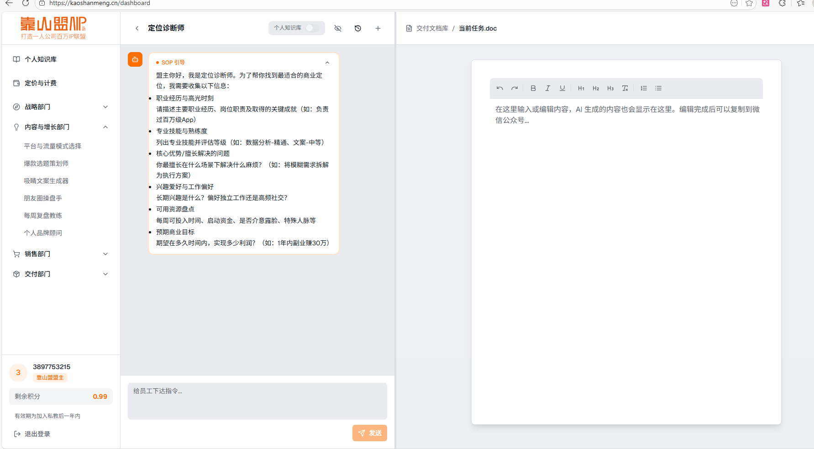

# 阿里云服务器手动部署指南

## 📋 概述

由于阿里云服务器访问 GitHub 网络不稳定，无法使用 `git pull` 更新代码。本文档记录通过 **SCP 上传文件**的方式手动部署更新。

**服务器信息**：
- IP：106.14.115.73
- 用户：root
- 项目路径：/home/admin/kaoshanmeng
- 域名：https://kaoshanmeng.cn

---

## 🚀 快速部署流程

### 第一步：在本地查看修改的文件

```bash
# 在本地项目目录执行
cd d:\KaoShanMeng
git status
```

### 第二步：使用 SCP 上传文件

#### 上传单个文件

```bash
scp "d:\KaoShanMeng\文件路径" root@106.14.115.73:/home/admin/kaoshanmeng/文件路径
```

**示例**：
```bash
# 上传 app/page.tsx
scp "d:\KaoShanMeng\app\page.tsx" root@106.14.115.73:/home/admin/kaoshanmeng/app/page.tsx

# 上传 components/Header.tsx
scp "d:\KaoShanMeng\components\Header.tsx" root@106.14.115.73:/home/admin/kaoshanmeng/components/Header.tsx
```

#### 上传整个目录

```bash
scp -r "d:\KaoShanMeng\目录名" root@106.14.115.73:/home/admin/kaoshanmeng/
```

**示例**：
```bash
# 上传 app 目录
scp -r "d:\KaoShanMeng\app" root@106.14.115.73:/home/admin/kaoshanmeng/

# 上传 components 目录
scp -r "d:\KaoShanMeng\components" root@106.14.115.73:/home/admin/kaoshanmeng/

# 上传 miniprogram 目录
scp -r "d:\KaoShanMeng\miniprogram" root@106.14.115.73:/home/admin/kaoshanmeng/
```

### 第三步：在服务器上重启应用

```bash
# SSH 登录到服务器
ssh root@106.14.115.73

# 进入项目目录
cd /home/admin/kaoshanmeng

# 快速重启（5-10秒，只改代码时用这个）
docker compose restart

# 或重新构建（2-3分钟，改了依赖时用这个）
docker compose build && docker compose up -d

# 查看容器状态
docker compose ps

# 查看日志
docker compose logs --tail=20
```

### 第四步：验证部署

访问网站查看更新是否生效：
- https://kaoshanmeng.cn

---

## 📝 常用命令速查

### SCP 上传命令

| 操作 | 命令 |
|------|------|
| 上传单个文件 | `scp "本地路径" root@106.14.115.73:/home/admin/kaoshanmeng/服务器路径` |
| 上传整个目录 | `scp -r "本地目录" root@106.14.115.73:/home/admin/kaoshanmeng/` |
| 上传多个文件 | 多次执行 scp 命令 |

### 服务器操作命令

| 操作 | 命令 |
|------|------|
| SSH 登录 | `ssh root@106.14.115.73` |
| 进入项目 | `cd /home/admin/kaoshanmeng` |
| 快速重启 | `docker compose restart` |
| 重新构建 | `docker compose build && docker compose up -d` |
| 查看状态 | `docker compose ps` |
| 查看日志 | `docker compose logs -f` |
| 停止容器 | `docker compose down` |
| 启动容器 | `docker compose up -d` |

### 一键部署命令

```bash
# 上传文件后一键重启
ssh root@106.14.115.73 "cd /home/admin/kaoshanmeng && docker compose restart && docker compose ps"

# 上传文件后一键重新构建
ssh root@106.14.115.73 "cd /home/admin/kaoshanmeng && docker compose build && docker compose up -d && docker compose ps"
```

---

## ⚡ 部署场景选择

### 场景1：只修改了代码文件（最常见）

**特征**：修改了 .tsx、.ts、.js、.css 等代码文件

**部署方式**：
1. SCP 上传修改的文件
2. `docker compose restart`（5-10秒）

**示例**：
```bash
# 1. 上传文件
scp "d:\KaoShanMeng\app\page.tsx" root@106.14.115.73:/home/admin/kaoshanmeng/app/page.tsx

# 2. 重启
ssh root@106.14.115.73 "cd /home/admin/kaoshanmeng && docker compose restart"
```

### 场景2：修改了依赖或配置

**特征**：修改了 package.json、Dockerfile、docker-compose.yml

**部署方式**：
1. SCP 上传修改的文件
2. `docker compose build && docker compose up -d`（2-3分钟）

**示例**：
```bash
# 1. 上传文件
scp "d:\KaoShanMeng\package.json" root@106.14.115.73:/home/admin/kaoshanmeng/

# 2. 重新构建
ssh root@106.14.115.73 "cd /home/admin/kaoshanmeng && docker compose build && docker compose up -d"
```

### 场景3：添加了新目录或大量文件

**特征**：新增了整个功能模块、新目录

**部署方式**：
1. SCP 上传整个目录
2. `docker compose restart`

**示例**：
```bash
# 1. 上传目录
scp -r "d:\KaoShanMeng\app\api\auth" root@106.14.115.73:/home/admin/kaoshanmeng/app/api/

# 2. 重启
ssh root@106.14.115.73 "cd /home/admin/kaoshanmeng && docker compose restart"
```

---

## 🔧 故障排查

### 问题1：SCP 提示 "Are you sure you want to continue connecting"

**解决方法**：
1. 切换到英文输入法
2. 输入 `yes` 并按回车
3. 输入 root 密码

### 问题2：SCP 提示 "Permission denied"

**解决方法**：
1. 检查密码是否正确
2. 确认使用 root 用户
3. 检查服务器路径是否正确

### 问题3：容器没有运行

**症状**：`docker compose ps` 没有显示容器

**解决方法**：
```bash
# 启动容器
docker compose up -d

# 查看日志
docker compose logs -f
```

### 问题4：网站没有更新

**可能原因**：
1. 文件上传到错误的路径
2. 容器没有重启
3. 浏览器缓存

**解决方法**：
```bash
# 1. 检查文件是否上传成功
ssh root@106.14.115.73
ls -la /home/admin/kaoshanmeng/文件路径

# 2. 强制重启容器
docker compose down
docker compose up -d

# 3. 清除浏览器缓存或使用无痕模式
```

### 问题5：Docker 构建失败

**解决方法**：
```bash
# 查看详细错误日志
docker compose logs --tail=100

# 检查环境变量文件
cat .env.local

# 完全重新构建
docker compose down
docker compose build --no-cache
docker compose up -d
```

---

## 📌 注意事项

### 1. 文件路径

- ✅ 使用双引号包裹路径：`"d:\KaoShanMeng\app\page.tsx"`
- ❌ 不要省略引号：`d:\KaoShanMeng\app\page.tsx`（路径有空格时会失败）

### 2. 目录上传

- ✅ 使用 `-r` 参数：`scp -r "目录" root@...`
- ❌ 不要忘记 `-r`：`scp "目录" root@...`（会失败）

### 3. 重启方式

- ✅ 只改代码用 `restart`（快）
- ✅ 改依赖用 `build && up -d`（慢但完整）
- ❌ 不要每次都用 `build --no-cache`（太慢）

### 4. 环境变量

- ⚠️ 不要上传 `.env.local` 文件（包含敏感信息）
- ⚠️ 服务器上的环境变量文件不要删除

### 5. 备份

- 建议定期备份服务器上的代码
- 重要更新前先备份：`cp -r kaoshanmeng kaoshanmeng.bak`

---

## 🎯 最佳实践

### 1. 批量上传文件

如果修改了多个文件，可以写一个批处理脚本：

**upload.bat**（Windows）：
```batch
@echo off
echo 上传文件到阿里云服务器...

scp "d:\KaoShanMeng\app\page.tsx" root@106.14.115.73:/home/admin/kaoshanmeng/app/page.tsx
scp "d:\KaoShanMeng\components\Header.tsx" root@106.14.115.73:/home/admin/kaoshanmeng/components/Header.tsx

echo 上传完成！
echo 现在请在服务器上执行: docker compose restart
pause
```

### 2. 使用 VS Code Remote SSH

更方便的方法：
1. 在 VS Code 中安装 Remote SSH 扩展
2. 连接到服务器：`ssh root@106.14.115.73`
3. 直接在 VS Code 中编辑服务器上的文件
4. 保存后自动同步
5. 在终端执行 `docker compose restart`

### 3. 定期检查容器状态

```bash
# 每天检查一次
ssh root@106.14.115.73 "cd /home/admin/kaoshanmeng && docker compose ps && docker compose logs --tail=10"
```

---

## 📚 相关文档

- [Docker Compose 文档](https://docs.docker.com/compose/)
- [SCP 命令详解](https://linux.die.net/man/1/scp)
- [Next.js 部署文档](https://nextjs.org/docs/deployment)

---

## 🆘 获取帮助

如果遇到问题：
1. 查看 Docker 日志：`docker compose logs -f`
2. 查看 Nginx 日志：`sudo tail -f /var/log/nginx/error.log`
3. 检查容器状态：`docker compose ps`
4. 检查磁盘空间：`df -h`

---

**最后更新**：2026-02-12
**适用版本**：Docker Compose v2+
**维护者**：靠山盟团队
